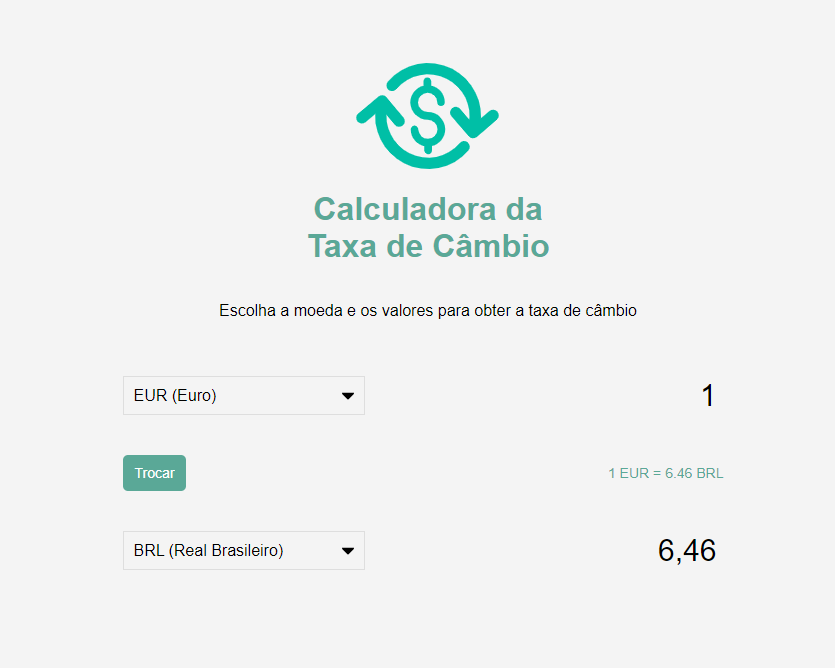

# Exchange Rate Calculator

Calculadora da taxa de câmbio, conversor de moeda

 

## Api Utilizada

 + [Exchange Rate API](https://www.exchangerate-api.com/)
 ```
 [Nota] Utilizado neste projeto a versão 4 da api, pois apartir da versão 5 é obrigatório obter uma key,
 sendo necessário cadastro no site.
 
 Versão 4: https://api.exchangerate-api.com/v4/latest/${}
 ```

